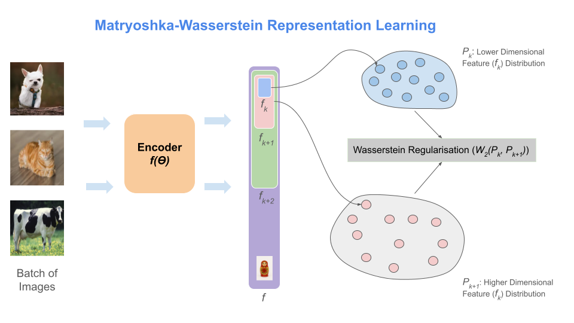
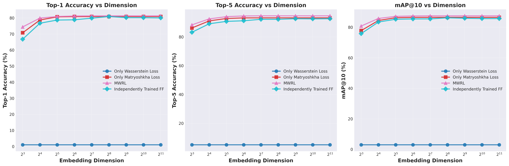
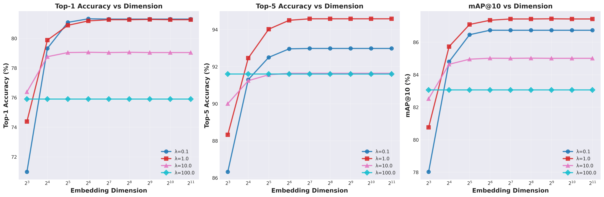
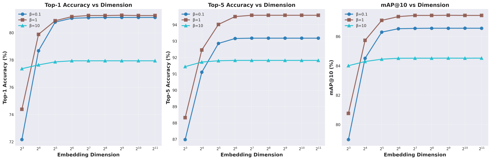
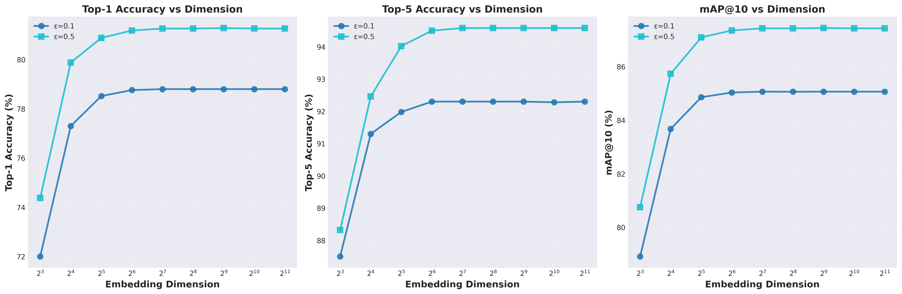
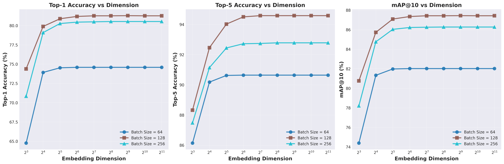
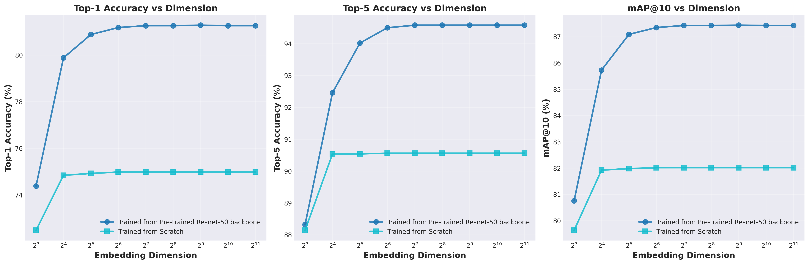

# MWRL: Matryoshka-Wasserstein Representation Learning

<p align="center">
  
</p>

**Official PyTorch implementation of Matryoshka-Wasserstein Representation Learning (MWRL)**

MWRL combines multi-scale Matryoshka Representation Learning with Wasserstein regularization to learn hierarchical embeddings where lower-dimensional prefixes maintain high representation quality.

---

## 🎯 Key Features

- **Multi-scale embeddings**: Single model produces embeddings at 9 dimensions {8, 16, 32, 64, 128, 256, 512, 1024, 2048}
- **Wasserstein regularization**: Ensures smooth transitions between consecutive embedding dimensions
- **Efficient training**: Distributed training using MIG instances on A100 GPUs
- **Comprehensive evaluation**: Top-1, Top-5 accuracy and mAP@10 across all dimensions

---

## 🚀 Quick Start

### Installation
```bash
# Clone repository
git clone https://github.com/yourusername/mwrl.git
cd mwrl

# Create environment
python3 -m venv mwrl
source mwrl/bin/activate

# Install dependencies
pip install torch torchvision geomloss tensorboard tqdm pandas matplotlib
```

### Training
```bash
# Standard MWRL training
python run_mwrl_training_new.py

# Train vanilla baselines
python run_baseline_training.py

# Custom configuration
python train_mwrl_distributed_new.py \
    --batch-size 128 \
    --epochs 100 \
    --alpha 1.0 \
    --wasserstein-weight 1.0 \
    --num-gpus 4
```

---


## 🔬 Experiments


Generates:
- Loss curves comparison
- Metrics evolution
- Dimension scaling plots
- LaTeX tables

### Hyperparameter Ablations
```python
# Alpha (MRL weight): α ∈ {0, 0.5, 1.0}
# Wasserstein weight: λ ∈ {0.1, 1.0, 10.0}
# Residual penalty: β ∈ {0.1, 1.0, 10.0}
# Entropic regularization: ε ∈ {0.1, 0.5}
# Batch Size: bs ∈ {64, 128, 256}
# Pretrained weight Initialisation vs Training from scratch
```

### Results

#### Comparison of Different Loss function vs MWRL loss
<p align="center">
  
</p>
---

#### Effect of Lambda on MWRL training
<p align="center">
  
</p>
---

#### Effect of beta on MWRL training
<p align="center">
  
</p>
---

#### Effect of beta on MWRL training
<p align="center">
  
</p>
---

#### Effect of batch size on MWRL training
<p align="center">
  
</p>
---

#### Effect of BAckbone initialisation on MWRL training
<p align="center">
  
</p>
---

## 📁 Project Structure
```
MatryoWass/
├── train_mwrl_distributed_new.py    # Main training script
├── models/                          # MWRL model implementation
├── run_mwrl_training_new.py         # Training wrapper
├── train_baseline.py                # Baseline experiments
├── plot_multi_experiments.py        # Multi-experiment analysis
├── data/                            # Data loading utilities
├── utils/                           # Helper functions
└── results/                         # Experiment outputs (cretaed after running an experiment)
└── checkpoints/                     # Checkpoints saved (cretaed after running an experiment)
└── runs/                            # Tensorboard logs saved (cretaed after running an experiment)
```

---

## 🛠️ Implementation Details

**Architecture:**
- Backbone: ResNet-50 (ImageNet-1K pretrained)
- Nested classifiers at each dimension
- Differentiable Sinkhorn iterations via GeomLoss

**Training:**
- Optimizer: SGD (momentum 0.9)
- Learning rate: 0.1 → 0.001 (cosine annealing)
- Batch size: 128 (distributed across 4 MIG instances)
- Hardware: NVIDIA A100 (40GB) with 4 MIG partitions

**Loss Function:**
```
L = α · Σ w_k · CE(f_k(x), y) + λ · Σ W(f_k, f_{k+1})
```

Where `W` is the Wasserstein distance with custom cost function.

---

## 📈 Visualization

### Monitor Training
```bash
tensorboard --logdir runs/
```

### Generate Plots
```bash

python run_plot.py
```

---

## 📝 Citation
```bibtex
@article{ktanmay2024mwrl,
  title={Matryoshka-Wasserstein Representation Learning},
  author={Kumar Tanmay, Aditya Saxena},
  year={2025}
}
```

---

## 🙏 Acknowledgments

- [Matryoshka Representation Learning](https://arxiv.org/abs/2205.13147)
- [GeomLoss](https://www.kernel-operations.io/geomloss/) for differentiable optimal transport
- ImageNet-100 subset from [Tian et al.](https://github.com/HobbitLong/CMC)

---

## 📄 License

This project is licensed under the MIT License - see [LICENSE](LICENSE) file for details.

---

## 📧 Contact

For questions or issues, please open an issue or contact: kr.tanmay147@gmail.com

---


